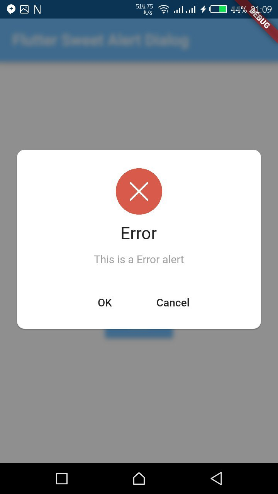
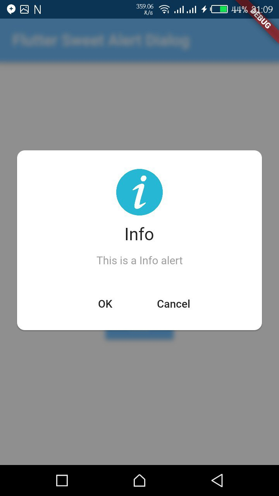

# ✨ Flutter Sweet Alert [](https://pub.dartlang.org/packages/sweet_alert_dialogs)

A Flutter plugin for displaying sweet alert dialogs.

Inspired by [rich_alert](https://github.com/thedejifab/rich_alert)


## 🎖 Installing
```
dependencies:
  sweet_alert_dialogs: "^0.1.0"
```

## ⚡️ Import
```
import 'package:sweet_alert/sweet_alert.dart';
```

## 📷 Screenshots

<table>
  <tr>
    <td align="center">
      
    </td>
    <td align="center">
      
    </td>
    <td align="center">
      
    </td>
  </tr>
</table>

## 🎮 How To Use

```
showDialog(
    context: context,
    builder: (BuildContext context) {
       return RichAlertDialog(
          alertTitle: richTitle("Success"),
          alertSubtitle: richSubtitle("This is a Sucess alert"),
          alertType: RichAlertType.SUCCESS,
          actions: <Widget>[
            FlatButton(
              child: Text("OK"),
              onPressed: (){Navigator.pop(context);},
            ),
            FlatButton(
              child: Text("Cancel"),
              onPressed: (){Navigator.pop(context);},
            ),
          ],
       );
    }
);
```

## 🐛 Bugs/Requests

If you encounter any problems feel free to open an issue. If you feel the library is
missing a feature, please raise a ticket on Github and I'll look into it.
Pull request are also welcome.

### ❗️ Note

For help getting started with Flutter, view the online
[documentation](https://flutter.io/).

For help on editing plugin code, view the [documentation](https://flutter.io/platform-plugins/#edit-code).

## ⭐️ License
MIT Licence